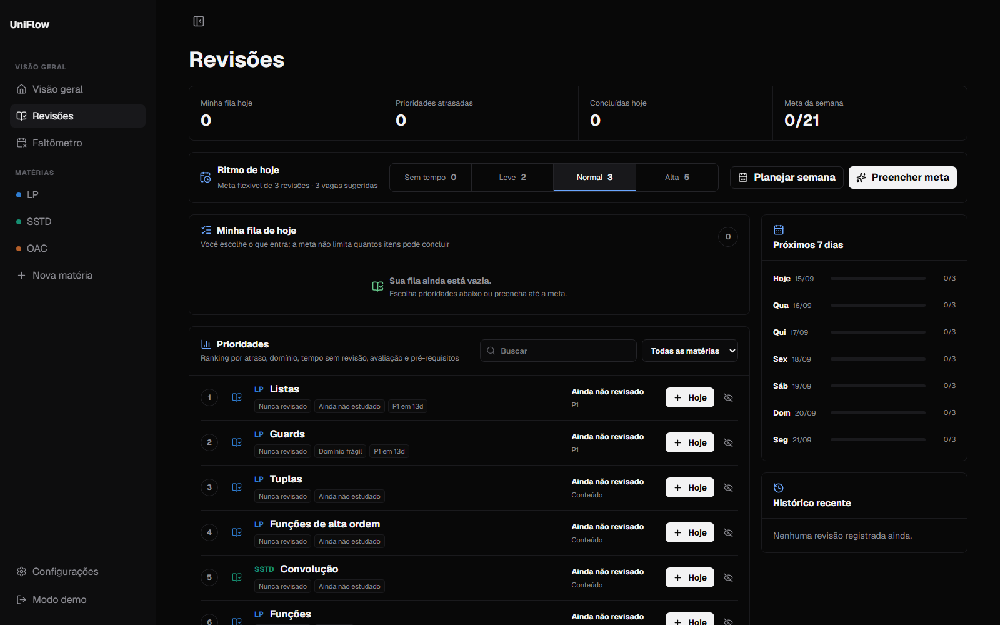

# UniFlow

**Seu semestre, materiais e revisões em um único fluxo.**

Uma plataforma de organização acadêmica criada para transformar prazos,
conteúdos e arquivos espalhados em uma rotina de estudo clara e flexível.

[**Acessar o UniFlow**](https://uniflow-gamma.vercel.app)

## Sobre o UniFlow

O UniFlow nasceu de uma necessidade real: acompanhar várias matérias sem depender
de planilhas, pastas desconectadas e planejamentos rígidos que deixam de funcionar
quando a rotina aperta.

Em vez de decidir tudo pelo estudante, o sistema reúne o contexto acadêmico,
organiza prioridades e permite que cada pessoa monte o próprio ritmo do dia.
O objetivo é reduzir o esforço de organização para sobrar mais atenção para o que
realmente importa: estudar.

## Acesse

A versão atual está disponível em:

### [uniflow-gamma.vercel.app](https://uniflow-gamma.vercel.app)

Crie sua conta ou entre com uma conta existente. Cada usuário possui seu próprio
espaço de matérias, arquivos, notas e histórico de estudos.

> O UniFlow está em desenvolvimento ativo. A versão publicada já é funcional,
> mas novos recursos e ajustes de experiência continuam sendo adicionados.

## O que você encontra

| Área | Recursos |
| --- | --- |
| **Visão geral** | Prazos, pendências e avaliações importantes reunidos em um painel. |
| **Revisões** | Ranking inteligente, fila diária escolhida pelo estudante, metas flexíveis, pré-requisitos e histórico de consistência. |
| **Matérias** | Conteúdos, tarefas, avaliações, preparação para provas, notas e acompanhamento do semestre. |
| **Materiais** | Pastas aninhadas, reordenação por arrastar, movimentação de arquivos, download em ZIP e marcador de onde a turma parou. |
| **PDFs** | Leitura em nova aba e editor para textos, imagens, destaques e desenhos, preservando o original quando desejado. |
| **Listas** | Progresso por questão e item, dificuldade, observações e suporte para listas que começam na questão zero. |
| **Cadernos** | Editor de respostas vinculado às listas, com formatação rica, imagens, autosave, sumário de questões e exportação em PDF. |
| **Faltômetro** | Controle de presença, limite de faltas e projeção do restante do semestre. |

## Revisões que se adaptam à rotina

O planejamento de revisões foi pensado para dias que nem sempre saem como o
esperado. O UniFlow oferece uma meta baseada na disponibilidade informada, mas não
impõe um limite: é possível revisar menos, ultrapassar a meta ou escolher um
conteúdo previsto para outro dia.

As prioridades consideram fatores como:

- tempo desde a última revisão;
- nível de domínio do conteúdo;
- proximidade de avaliações;
- revisões atrasadas;
- pré-requisitos ainda não estudados.

O histórico em formato de mapa de atividade ajuda a enxergar consistência sem
transformar o estudo em uma obrigação punitiva.

## Cadernos para listas

Cada lista pode ter um caderno próprio para respostas discursivas. O editor reúne
fontes, tamanhos, espaçamento, destaques, imagens, listas e blocos de código em uma
folha preparada para impressão. As questões do dashboard podem ser inseridas como
estrutura do documento sem substituir o que já foi escrito.

O conteúdo é salvo automaticamente e também recebe uma cópia local de segurança.
Depois, o caderno pode ser retomado para edição ou exportado em PDF.

## Materiais sem perder o contexto

O gerenciador de materiais segue uma lógica familiar de explorador de arquivos.
Pastas podem conter outras pastas, e arquivos podem ser reorganizados ou movidos
com o mouse. Para acompanhar as aulas, também é possível marcar o PDF e a página
em que o professor parou.

Os arquivos ficam em armazenamento privado, e o acesso aos dados é isolado por
usuário com políticas de Row Level Security do Supabase.

## Recursos experimentais

- **Tópicos com IA:** transforma PDFs selecionados em um rascunho editável de
  conteúdos para uma avaliação. Nada é criado sem revisão e confirmação.
- **Integração MCP:** permite que clientes compatíveis, como o ChatGPT, consultem
  o contexto acadêmico do UniFlow por ferramentas somente de leitura.

## Tecnologia

O UniFlow é construído com **Next.js**, **React**, **TypeScript**, **Supabase** e
**Vercel**. A interface utiliza componentes próprios, `Tiptap` para edição de
documentos e ícones do `lucide-react`.

## Visão de produto

Hoje o UniFlow é um projeto pessoal em evolução, desenvolvido e validado a partir
de uma rotina universitária real. A direção futura é transformá-lo em um SaaS de
organização acadêmica que continue simples mesmo quando o semestre não é.

Entre os próximos passos estão um onboarding mais acessível, notificações úteis,
integrações de calendário, automações de organização e assistência por IA com
controle explícito do estudante.

---

Desenvolvido por [Luidgi Varela](https://github.com/LuidgiVarela).

[Acessar o UniFlow](https://uniflow-gamma.vercel.app) · [Ver o repositório](https://github.com/LuidgiVarela/UniFlow)

